# Features

## Core Experience

### Upload

Upload a recipe document (PDF/TXT) and start a guided cooking session instantly.

### Chat

Ask the assistant for help, substitutions, and step-by-step guidance in a dedicated chat panel.

### Step progress

Track cooking progress with a clear step list and a single “Next” flow.

### Scale servings

Adjust servings with a purpose-built control on both mobile and desktop.

### Ingredient swapping

Swap ingredients directly from the ingredients panel and see updates immediately.

### Responsive layouts

Mobile and desktop layouts are tuned for their screen sizes and controls.

### Error handling

Upload errors surface clearly with user-friendly feedback.

## Screenshots

### Upload error

Shows the upload failure state and inline error feedback.

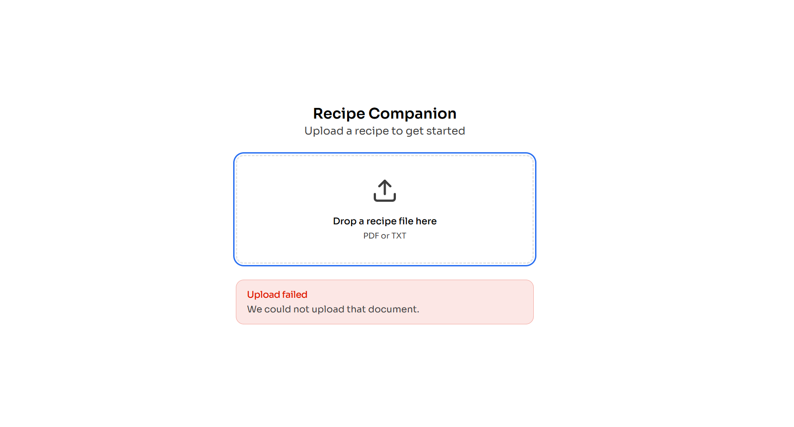

### Ingredient swap flow

The flow for swapping an ingredient via UI controls.

1. 
2. 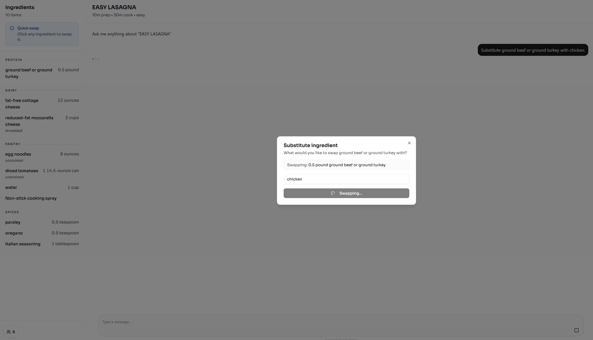
3. 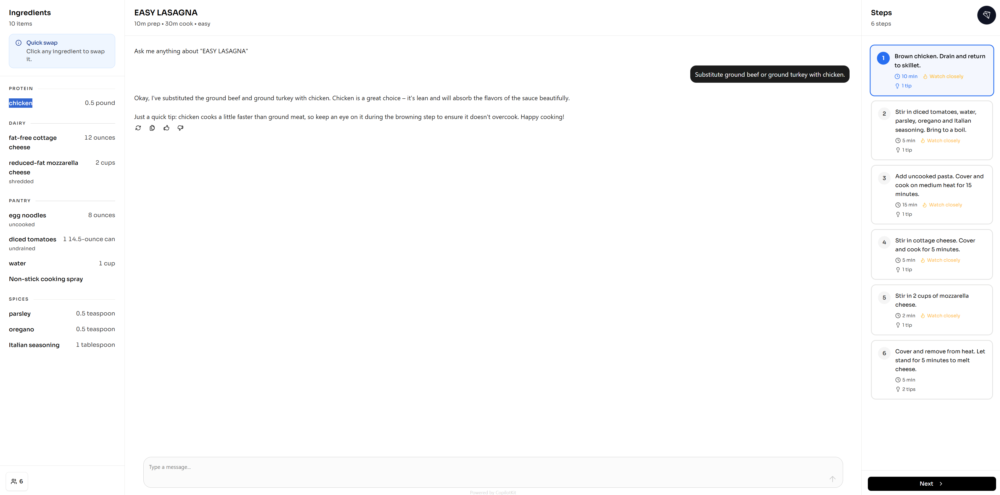

### Step progress flow

Step tracking and progression in the cooking view.

1. 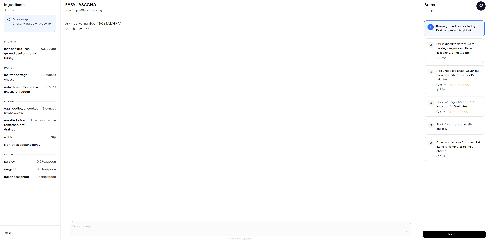
2. 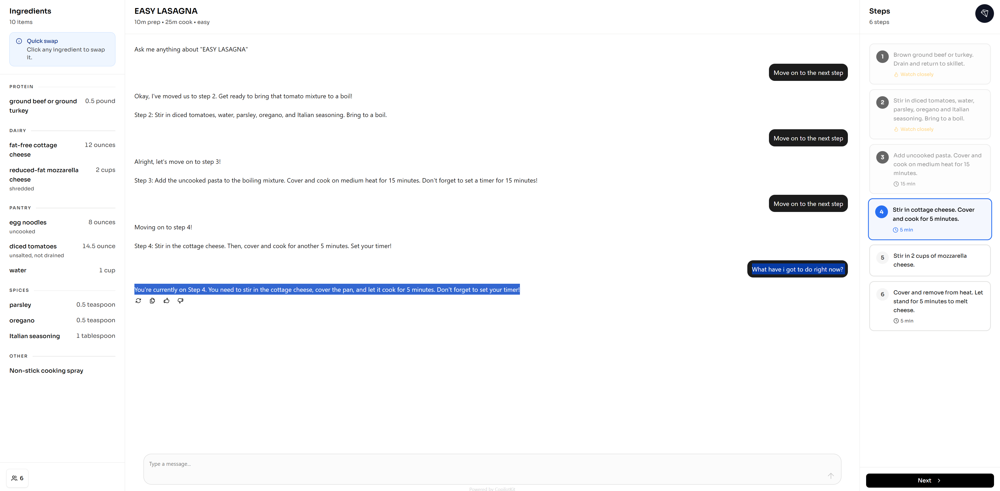
3. 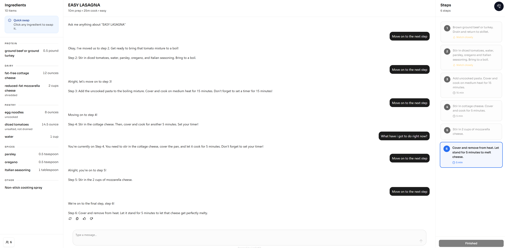

### Scale servings flow

Adjusting servings and seeing updated quantities.

1. 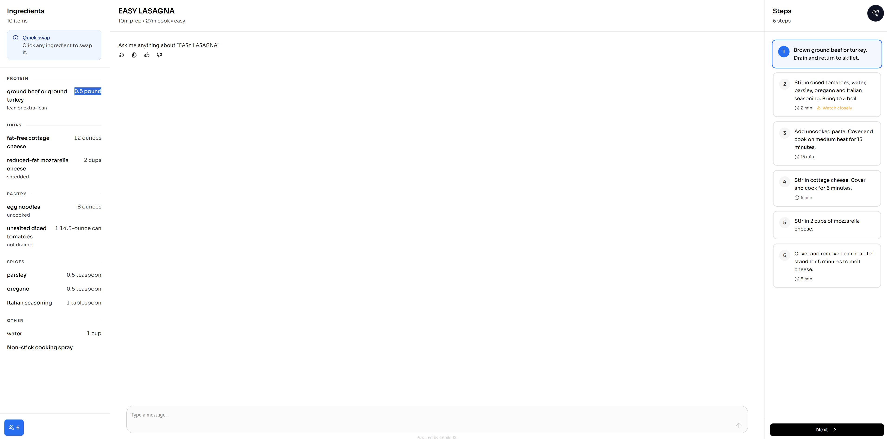
2. 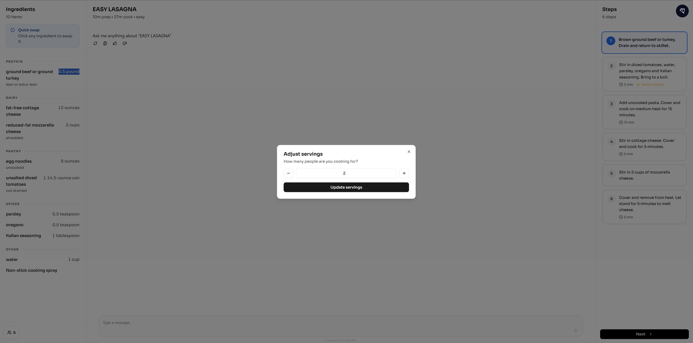
3. 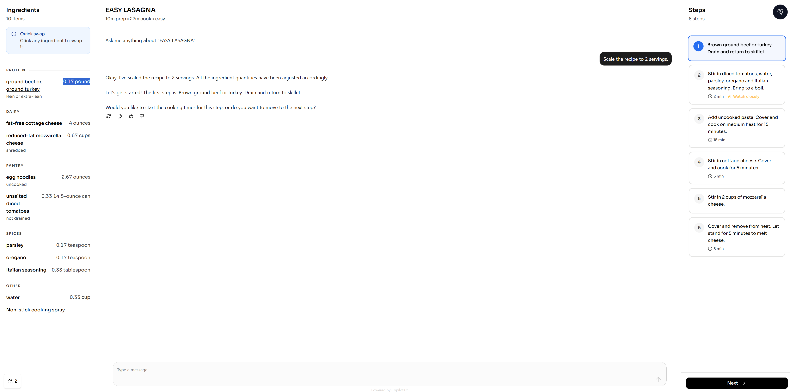

### Mobile views

Key screens in the mobile layout.

1. 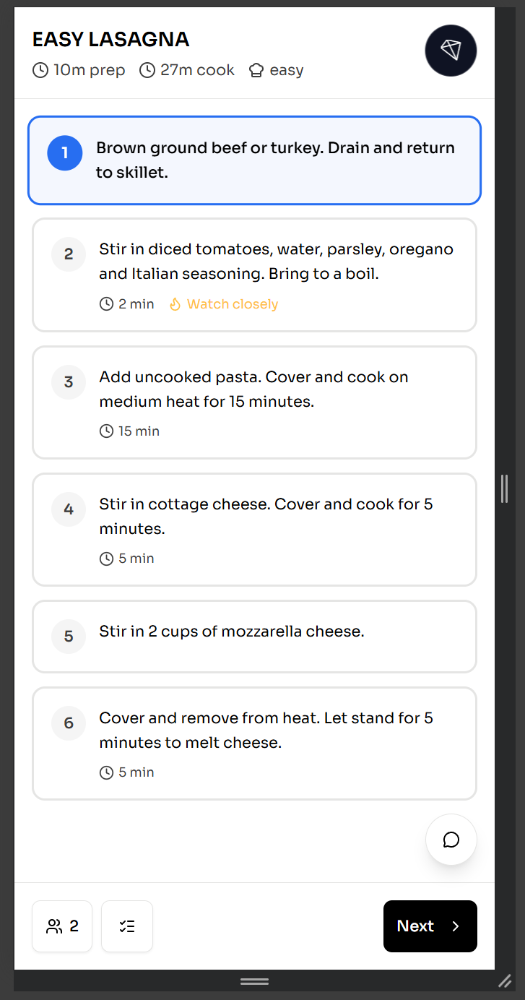
2. 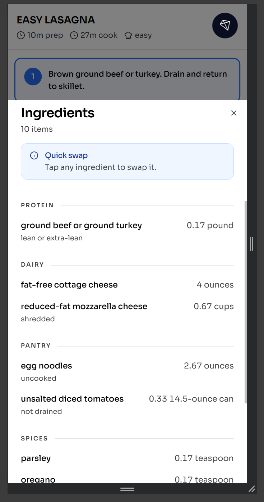
3. 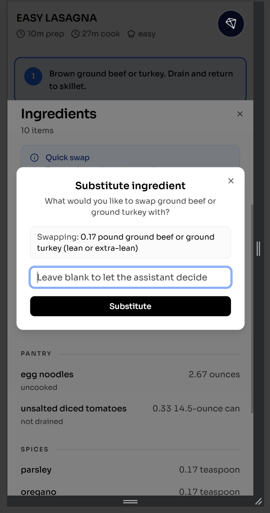
4. 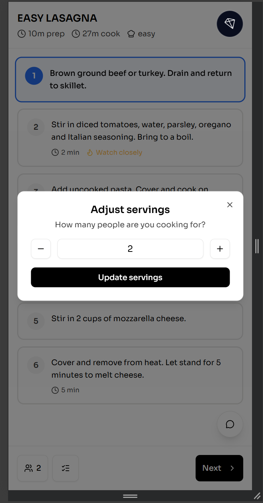
5. 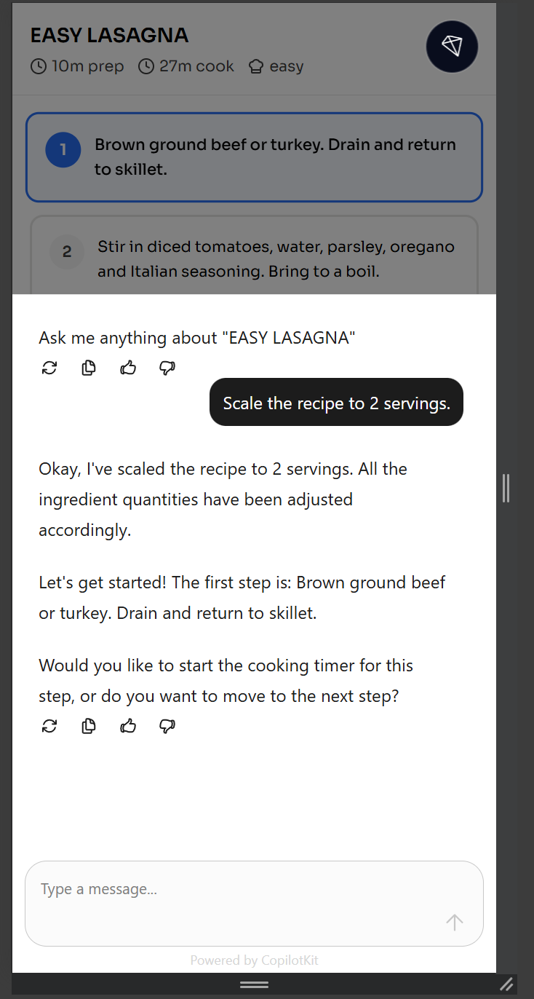

## Demo Video

<video controls width="100%">
  <source src="../media/20.01.2026_17.25.08_REC.mp4" type="video/mp4" />
  Your browser does not support the video tag.
</video>
